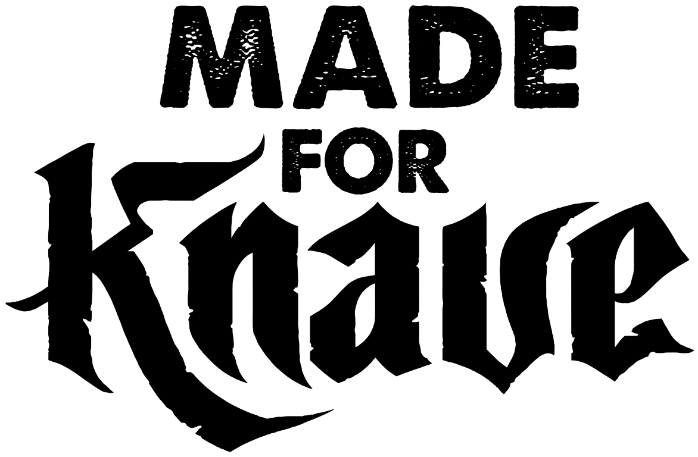

# Base Knavery

A [Foundry VTT](https://foundryvtt.com) game system compatible with **Knave 2e**.
Use it to run old TSR modules, OSE and other OSR adventures, Dungeon Crawl
Classics adventures, and Knave hacks. Built on ApplicationV2 throughout, for
Foundry v14.

*Base Knavery is an independent production of Dom Bosco and is not affiliated
with Questing Beast LLC.*



## Install

In Foundry's **Game Systems → Install System**, paste the manifest URL:

```
https://github.com/domfortunato/base-knavery-foundryvtt/releases/latest/download/system.json
```

## What you get

**The character sheet**
- The Air Bladder layout: portrait, name with **pronouns** beside it, careers,
  level and XP.
- HP, AC, wounds and coins.
- **Rest**, **Heal Wound** and the **Die of Fate**.
- Six ability buttons, each showing its defense.
- Tabs for Items, Description and Notes.
- Values highlight when they are low or in peril (amber below max, red at 0),
  and banners appear for no HP, wounded slots, overburdened and dead.

**Rolls**
- Every check, save and attack asks **Disadvantage / Normal / Advantage**.
- The GM chooses how edges work:
  - *Knave 2e as written*: +5 / −5.
  - *2d20*: keep the higher or the lower die.
- Attacks have a **"Roll damage at the same time"** box, ticked by default.
- Attacks roll d20 + STR (melee) or WIS (ranged) against each targeted
  token's AC.
  - A total of 21 or more flags a free maneuver.
  - A natural 1 breaks the weapon. This is a setting.
  - A power attack doubles the damage dice.
- Saves from other games (paralysis, breath and blast, poison and death,
  magic device, spells) resolve as the matching ability check.

**Damage and wounds**
- Damage comes off HP first. Each point past 0 fills an item slot with a
  wound, from the top down, and items in wounded slots are marked
  *drop it*.
- Direct damage skips HP. Monsters take it tripled.

**Inventory**
- 10 + CON slots, and every full 500 coins fill one.
- Equipping armor raises AC (11 + armor points, at most 7).
- Equipping a weapon adds it to **Attacks**.
- **Give** an item to another character: the other player accepts it on a chat
  card, and no GM needs to be online.

**Marketplace**
- Aisles of gear with prices.
- The GM's **Marketplace Manager** can add aisles, stock them by drag and drop,
  override prices and hide aisles.

**Character creation**
- **Create Character** offers a **random** knave or a **blank sheet**.
- The player chooses a starting level within the range the GM allows.
- **Character Creation Mode** adds dice and pick-lists to every field.
- **Level Up** appears once the XP is there.
- **Careers** are custom backgrounds. A career can:
  - add fields to the sheet (text, numbers, checkboxes, tracks, dice);
  - grant starting items;
  - carry Active Effects for mechanical bonuses.

**Portraits**
- A gallery and picker with four art sets, your own portrait folder, or any
  image path.

**Change log**
- Every hand edit to a sheet is whispered to the GM and the owners.

**The Game Master's Dashboard**
- Ask players for a check or save **and say why**. Each player sees the reason
  and a locked difficulty, and the results come back to the dashboard.
- Apply damage.
- Hazard dice, reaction, encounter distance and morale.
- Every table the system rolls on.
- Switches for the players' tools.

**GM macros**
- Toggle the player marketplace, character creation, creation tools and the
  change log.
- Open the dashboard, the Marketplace Manager and the table importer.

**The GLOG grimoire** (an optional hack)
- Bind spellbooks into a grimoire and cast them with Magic Dice.
- `[dice]` and `[sum]` in the spell text are filled in when you cast.
- Doubles roll a mishap; triples mean doom.

**Bestiary**
- Classic monsters and hirelings as statistics, ready to drop on a scene.

## The tables are yours to fill

Knave 2e's text is not licensed for reuse, so **every rollable table ships as
an empty shell**. That covers careers, spells, names, traits, reaction and
mishaps. Each shell has the right name and dice.

To fill a table:
1. Open the GM Dashboard, go to **Tables**, and click **Import** next to it.
2. Paste your rows, e.g. `01-05 Rat-catcher: cage, sack, terrier`.

This creates a **world** table with the same name, and the system uses it from
then on. Careers written as `Name: item, item, item` bring their starting items
with them.

## Licensing

See [LICENSE.txt](LICENSE.txt).
- The code is **MIT** and descends from Air Bladder and Cairn-FoundryVTT.
- The art keeps its own licences:
  - game-icons.net, CC BY 3.0
  - Jon Aspeheim, CC BY 4.0
  - tlomdev, CC BY-SA 4.0
  - Lydia Comer, CC BY-NC-SA 4.0 (so the system as a whole may not be sold)
- The "Made for Knave" logo is used under the Knave: Second Edition Third Party
  License.
- The system contains no text from Knave 2e and none from Dungeon Crawl
  Classics.
